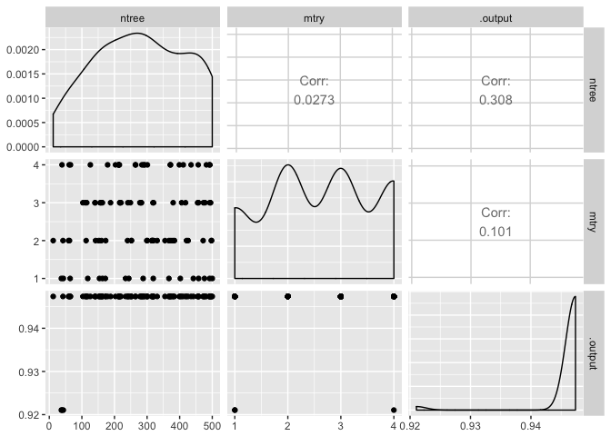

Background
==========

Random search is a simple and effective technique for hyperparameter optimization. Random search has a probability of 95% of finding a combination of parameters within the 5% optima with only 60 iterations (see [Bergstra and Bengio](http://www.jmlr.org/papers/volume13/bergstra12a/bergstra12a.pdf)).

Installation
============

The latest version can be installed through:

``` r
devtools::install_github("beringresearch/ABC/RandomParameterSearch")
```

Example
=======

Let's perform a random search to identify a comination of trees/mtry that maximise overall accuracy of a Random Forest algorithm on the Iris dataset.

NOTE: This is a poor example because the there is a strong separability between Iris classes, thus classification is not sensitive to hyperparameter variability.

First we create training and validation sets:

``` r
library(randomForest)
library(RandomParameterSearch)

set.seed(1234)
frac <- round(0.75 * nrow(iris))
trainIndex <- sample(1:nrow(iris), frac, replace = FALSE)

x_train <- iris[trainIndex, 1:4]
y_train <- iris[trainIndex, 5]
x_test <- iris[-trainIndex, 1:4]
y_test <- iris[-trainIndex, 5]
```

Now let's set up our search space:

``` r
params <- list(ntree = c(1L, 500L),
               mtry = c(1L, 4L))
grid <- create_random_grid(nrounds = 100, params = params, seed = 1234)
grid
```

    ## $ntree
    ##   [1] 476  61 110 457 473 140  62 399 373 458 498 472 244 142 126 252 249
    ##  [18] 160 482 318  64 212 458 234 455 299 316 435 252 492 163 241 179 314
    ##  [35] 371 283 491 289 220 115  42 426 118 495 301 500 188 278 215 288 217
    ##  [52] 113  43 319 216  37 402 163 379 293 355 214 172 380 213 281  59 152
    ##  [69] 240 173 301  39 478  12 421 317 156 372 320 497  65 442 406 411 418
    ##  [86] 367 492 320 331 265 159 384 264 367 154 203 103 493 284 141
    ## 
    ## $mtry
    ##   [1] 1 4 3 4 3 3 2 4 2 1 2 2 1 2 4 2 3 2 4 3 1 4 3 1 3 2 2 4 2 1 1 3 4 2 4
    ##  [36] 3 4 4 3 3 2 2 1 3 2 1 3 3 4 1 3 2 1 1 3 1 1 3 2 4 2 4 1 3 4 3 2 2 2 2
    ##  [71] 4 4 3 2 2 2 3 4 3 2 4 1 3 4 3 1 3 2 2 4 3 2 4 2 1 4 3 4 4 3

And a function that we wish to evaluate:

``` r
func <- function(ntree, mtry){
  rf <- randomForest(x = x_train, y = y_train, ntree = ntree, mtry = mtry)
  yh <- predict(rf, x_test, type = "prob")
  lbl <- colnames(yh)[apply(yh, 1, which.max)]

  sum(lbl == y_test)/length(y_test)
}
```

Finally, setting up the random search:

``` r
search <- random_search(func, grid = grid)

head(search)
```

    ##   ntree mtry   .output
    ## 1   476    1 0.9473684
    ## 2    61    4 0.9473684
    ## 3   110    3 0.9473684
    ## 4   457    4 0.9473684
    ## 5   473    3 0.9473684
    ## 6   140    3 0.9473684

``` r
library(ggplot2)
library(GGally)

ggpairs(search)
```


