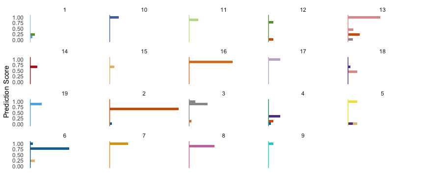

Installation
============

The latest version can be installed through:

``` r
devtools::install_github("beringresearch/ABC/confused")
```

Examples
========

Squares
-------

Squares is a visualisation technique developed by Microsoft to [support interactive performance analysis for multiclass classifiers](https://www.microsoft.com/en-us/research/publication/squares-supporting-interactive-performance-analysis-multiclass-classifiers/). Squares facilitates display of instance level distribution information, which is necessary for informative model selection and hyperparameter tuning.

``` r
library(confused)
library(rpart)
```

    ## Warning: package 'rpart' was built under R version 3.3.2

``` r
library(mlbench)

data(Soybean)
Soybean$Class <- as.factor(as.numeric(Soybean$Class))
levels(Soybean$Class)
```

    ##  [1] "1"  "2"  "3"  "4"  "5"  "6"  "7"  "8"  "9"  "10" "11" "12" "13" "14"
    ## [15] "15" "16" "17" "18" "19"

``` r
dim(Soybean)
```

    ## [1] 683  36

Let's built a simple Rpart classifier:

``` r
Y <- Soybean[, 1]

set.seed(123)
trainIndex <- sample(seq_len(nrow(Soybean)), size = round(0.75 * nrow(Soybean)), replace = FALSE)

train <- Soybean[trainIndex, ]
test <- Soybean[-trainIndex, ]

model <- rpart(Class~., data = train)
yh <- predict(model, test)
```

Finally, visualise performance:

``` r
squares(yh, test$Class)
```



All classes are represented with facets, whilst frequency distribution of probability estimates of each class instance is visualised as a histogram. It can be seen that our model is excellent in predicting classes *7*, *9*, *10*, and *17*.

Confusion Matrix
----------------

A graphical representation of a confusion matrix. We retain class probabilities generated in previous section.

``` r
lbl <- colnames(yh)[apply(yh, 1, which.max)]
confusion_matrix(lbl, test$Class)
```


