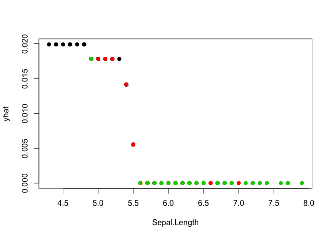

Motivation
==========

Black box prediction methods like random forests and neural networks form the backbone of many computational analyses. Nevertheless, it can be difficult to understand functional relationships between predictors and outcome when decision rules are not explicitly stated.

A number of approaches have been introduced to help researchers peak into black box models to get a better understanding of its inner workings. Some examples are:

-   Local Interpretable Model-Agnostic Explanations (LIME) - [python](https://github.com/marcotcr/lime) and [R](https://github.com/thomasp85/lime) code.

-   Partial Dependency Plots - [R](https://github.com/bgreenwell/pdp) code.

-   Individual Conditional Expectation (ICE) - [R](https://github.com/kapelner/ICEbox) code.

**quickpeak** package does not attempt to replace any of these algorithms. In fact, the package offers only a very rough estimate of Partial Dependency Plots and is not suitable of rigurous analysis. The main focus of the package is on computational speed.

Installation
============

The latest version can be installed through:

``` r
devtools::install_github("beringresearch/ABC/quickpeak")
```

Example
=======

``` r
library(quickpeak)
library(ranger)

model <- ranger(data=iris, dependent.variable.name="Species", probability=TRUE)

# Ranger's implementation of the predict function is not standard.
# We create our own and pass it to quickpeak.

custom_predict <- function(model, newdata){
    predict(model, newdata)$predictions
}

# Note that we must exclude the column that contains our outcome vector from the training dataset prior to passing it to qpeak.

qp <- qpeak(model=model, X=iris[,-5], feature="Sepal.Length", predict=custom_predict)

head(qp)
```

    ##   Sepal.Length       odds
    ## 1          5.1 0.01832994
    ## 2          4.9 0.01832994
    ## 3          4.7 0.01832994
    ## 4          4.6 0.01832994
    ## 5          5.0 0.01832994
    ## 6          5.4 0.01574403

The function returns odds such that higher values indicate greater affinity towards output of interest. We can now visualise the "decision vector" in our iris model.

``` r
plot(qp, pch=19, col=iris$Species)
```


